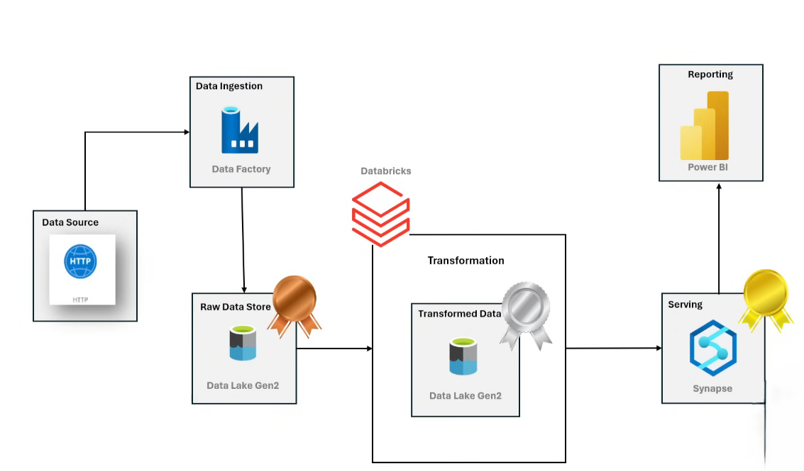
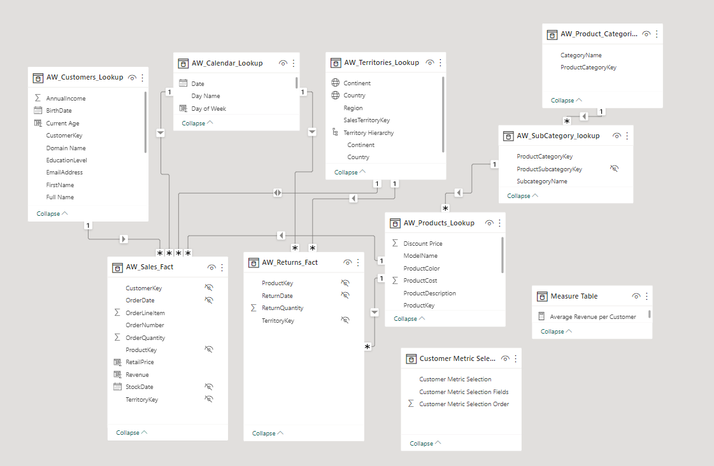

# AdventureWorks Data Engineering Project | Microsoft Azure

## Project Overview
This project demonstrates an end-to-end data engineering pipeline using **Microsoft Azure** to process and visualize **AdventureWorks** (bike sales) data. The pipeline involves multiple layers for data ingestion, transformation, and serving, culminating in the creation of a Power BI dashboard for data visualization.

**Key Features:**
- ETL pipeline using **Azure Data Factory**.
- Data transformation with **Databricks** and **PySpark**.
- Data storage in **Azure Data Lake** (Bronze, Silver, and Gold layers).
- Data serving and visualization through **Azure Synapse Analytics** and **Power BI**.

## Technologies Used
- **Azure Data Factory** (for ETL pipeline)
- **Azure Data Lake** (for raw and transformed data storage)
- **Databricks** (for data transformation with PySpark)
- **Azure Synapse Analytics** (for data serving with SQL)
- **Power BI** (for data visualization)
- **Azure Entra ID** (for access control to resources)
- **SQL** (for querying and creating external tables)

## Project Architecture

Here is the **Architecture Diagram** of the project, which illustrates the flow from data ingestion to visualization:

## Data Model

The following **Data Model** represents the key entities and relationships within the AdventureWorks dataset:

## Project Structure
The repository is structured as follows:

