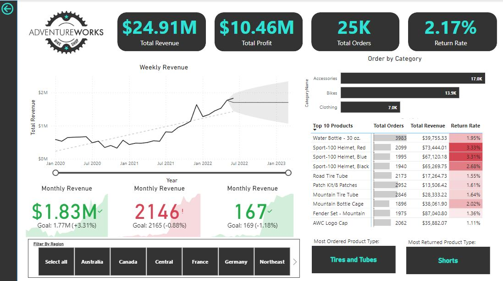
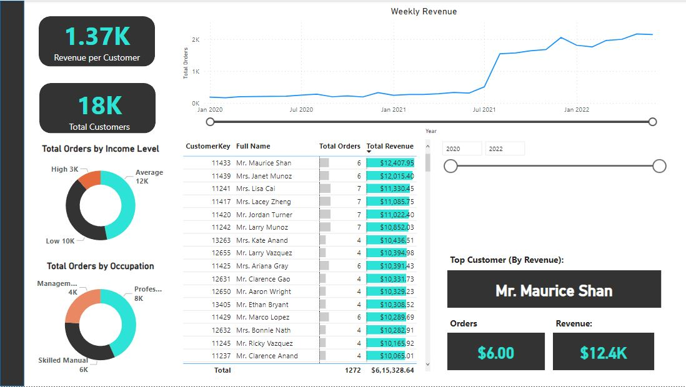

# AdventureWorks Data Engineering Project | Microsoft Azure

## Project Overview
This project demonstrates an end-to-end data engineering pipeline using **Microsoft Azure** to process and visualize **AdventureWorks** (bike sales) data. The pipeline involves multiple layers for data ingestion, transformation, and serving, culminating in the creation of a Power BI dashboard for data visualization.

**Key Features:**
- ETL pipeline using **Azure Data Factory**.
- Data transformation with **Databricks** and **PySpark**.
- Data storage in **Azure Data Lake** (Bronze, Silver, and Gold layers).
- Data serving and visualization through **Azure Synapse Analytics** and **Power BI**.

## Technologies Used
- **Azure Data Factory** (for ETL pipeline)
- **Azure Data Lake** (for raw and transformed data storage)
- **Databricks** (for data transformation with PySpark)
- **Azure Synapse Analytics** (for data serving with SQL)
- **Power BI** (for data visualization)
- **Azure Entra ID** (for access control to resources)
- **SQL** (for querying and creating external tables)

## Project Architecture

Here is the **Architecture Diagram** of the project, which illustrates the flow from data ingestion to visualization:

## Data Model

The following **Data Model** represents the key entities and relationships within the AdventureWorks dataset:

## Power BI Dashboards

Below are the **Power BI Dashboards** created using data served from **Azure Synapse Analytics**:

### 1. **Executive Summary Dashboard**

This dashboard provides an overview of key metrics and insights into overall business performance, focusing on high-level sales and operational metrics.

### 2. **Customer Details - Top Revenue Customers**

This dashboard visualizes the details of top revenue-generating customers, including their demographics, regions, and purchasing patterns.

## Step-by-Step Guide

### 1. **Data Ingestion - Bronze Layer (Raw Data)**
- **Tool Used**: Azure Data Factory (ADF)
- **Description**: I created an ETL pipeline in Azure Data Factory to dynamically ingest raw data from **GitHub raw file URLs** and store it into the **Azure Data Lake** (Bronze Layer).

### 2. **Data Transformation - Silver Layer**
- **Tool Used**: Databricks, PySpark
- **Description**: Using **Databricks**, I processed and transformed the raw data using **PySpark**. The transformed data was then written to the **Silver Layer** of Azure Data Lake.  
- **Access Control**: Configured **Azure Entra ID** to provide application-level permissions, allowing Databricks to access the Data Lake securely.

### 3. **Data Serving - Gold Layer**
- **Tool Used**: Azure Synapse Analytics, SQL
- **Description**: I used **Azure Synapse Analytics** to create a **serverless database** and external tables using **SQL**. This allowed me to access the transformed data stored in the **Silver Layer** and serve it for further analysis.

### 4. **Data Visualization**
- **Tool Used**: Power BI
- **Description**: Finally, I used **Power BI** to connect to **Synapse Analytics**, retrieve the processed data, and create a **dashboard** to visualize the bike sales insights.

## How to Run the Project

### Prerequisites:
- **Azure Subscription** (with access to Azure Data Factory, Databricks, Synapse Analytics, etc.)
- **Power BI Desktop** (for viewing the dashboard)

### Steps:
1. **Set up Azure Resources**:
   - Create a **Resource Group** in Azure.
   - Set up **Azure Data Lake**, **Azure Data Factory**, **Databricks**, and **Azure Synapse Analytics**.

2. **Run the ETL Pipeline**:
   - Deploy the **Azure Data Factory pipeline** to fetch raw data from GitHub and load it into Data Lake (Bronze Layer).

3. **Transform Data**:
   - Use **Databricks** to run the **PySpark notebook** for data transformation and store the results in the **Silver Layer** of Data Lake.

4. **Serve Transformed Data**:
   - Use **Azure Synapse Analytics** to query and create external tables for the transformed data (Gold Layer).

5. **Power BI**:
   - Open the **Power BI Dashboard** to visualize the data insights. 

## How to Contribute
Feel free to fork this repository, make improvements, or suggest changes via pull requests. Contributions are welcome!

## Contact Information
For any questions, feel free to reach out to me:
- **LinkedIn**: https://www.linkedin.com/in/steve-monteiro-02360a226/

